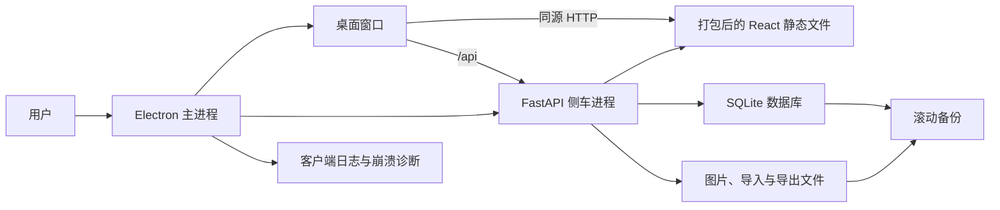

# 附录A编写工具客户端封装实施方案

## 1. 背景与结论

当前工具采用 React/Vite 前端、FastAPI 后端、SQLite 数据库和本地 `storage/` 文件目录。开发时需要分别启动前端和后端，依赖浏览器地址与端口；这会增加首次使用、端口冲突、服务未启动和数据位置不清晰等成本。

本专项将工具封装为 Windows 桌面客户端。客户端继续复用现有业务能力，不把附录A工具改造成在线服务，也不改动原始样本文档 `附录A编写.docx`。目标是让用户像使用普通办公软件一样安装、启动、保存、导入和导出。

推荐采用：**Electron 桌面壳 + 打包后的 React 前端 + PyInstaller 打包的 FastAPI 侧车服务 + NSIS 安装包**。

选择该方案的原因：

- 当前前端已是 React，后端已是 Python/FastAPI，业务代码复用比例最高。
- DOCX、Pillow、SQLite 和本地文件处理仍由 Python 完成，不需要重写导入导出逻辑。
- Electron 对 Windows 文件选择、剪贴板截图、下载保存、单实例启动和自动更新支持成熟。
- 可让客户端自动启动后端并使用随机本机端口，用户不再接触 `5174`、`8000` 等开发端口。

## 2. 目标与边界

### 2.1 用户目标

- 双击桌面图标即可打开，不要求先运行 PowerShell 脚本或浏览器。
- 项目、图片、导入源文件和导出 DOCX 持久保存在当前 Windows 用户的数据目录中。
- 现有本地 Web 版数据可选择性迁移到客户端，迁移失败不破坏源数据。
- 发生后端启动失败、异常退出或升级失败时，用户能获得明确提示、查看诊断信息并恢复最近备份。
- 安装包和后续升级均保留数据目录，不覆盖用户项目与证据图片。

### 2.2 第一版边界

- 第一版仅支持 Windows 10/11 x64。
- 首次客户端发布使用按用户安装的 NSIS 安装包，不要求管理员权限。
- 首次发布允许手动下载安装包；自动检查、下载并在退出后安装更新作为正式升级链路的一部分实现。
- 不改变现有 A-1 至 A-8、图片、引用、模板、DOCX 导入导出和项目校验的业务规则。
- 不将项目数据上传到外部服务器；所有项目数据仍保留在本机。
- 不承诺 macOS、Linux、多人协作、云同步或移动端支持。

## 3. 备选方案与取舍

| 方案 | 优点 | 主要代价 | 结论 |
| --- | --- | --- | --- |
| Electron + FastAPI 侧车 | 复用 React 和 Python；Windows 集成、更新和调试成熟 | 安装包体积较大 | 采用 |
| Tauri + FastAPI 侧车 | 安装包和运行时较轻 | 需引入 Rust 桌面层，调试和发布链路更复杂 | 暂不采用 |
| 保持浏览器 Web 版 | 无桌面壳改造 | 仍要管理端口、服务进程和浏览器入口 | 仅保留开发模式 |

## 4. 总体架构



### 4.1 桌面壳

新增 `desktop/` 工作区，负责：

- 创建主窗口、应用菜单、文件下载和窗口生命周期。
- 通过单实例锁保证重复启动时聚焦已有窗口，而不是再启动一套数据库服务。
- 启动、健康检查、停止和异常终止 FastAPI 侧车进程。
- 将主进程日志写入客户端数据目录，并在启动失败时展示可复制的诊断信息。
- 在没有导入、导出或保存任务运行时执行客户端更新。

Electron 渲染窗口不直接读取数据库或文件系统。业务读写始终经过本机 FastAPI API，避免出现 Web 版与客户端版两套数据写入逻辑。

### 4.2 后端侧车与页面访问

PyInstaller 将 FastAPI 应用及 Python 依赖打包为 `fulua-backend.exe`，采用 `onedir` 目录模式而不是单文件模式：启动更快，Pillow、lxml 等动态资源更稳定，安全软件误报风险也更低。

侧车服务启动时：

1. Electron 传入客户端数据根目录、前端静态目录和一次性会话标识。
2. Python 在 `127.0.0.1` 上绑定系统分配的空闲端口。
3. Python 向标准输出输出结构化 `FULUA_READY` 消息，包含端口和健康检查地址。
4. Electron 仅在健康检查成功后加载 `http://127.0.0.1:{port}/`。
5. 打包前端由同一个 FastAPI 服务提供，页面访问 API 使用相对路径 `/api`，不再依赖 Vite 编译时写死的 `8000` 端口，也不需要生产环境 CORS。

FastAPI 只监听回环地址，不暴露局域网端口。开发模式仍可保留 `scripts/start_dev.ps1`、Vite 和 `5174`，与客户端运行模式隔离。

### 4.3 建议目录

安装目录只保存程序，不保存用户数据。客户端数据根目录固定为：

```text
%LOCALAPPDATA%\附录A编写工具\
  data\app.db
  storage\uploads\
  storage\imports\
  storage\exports\
  storage\previews\
  logs\desktop-main.log
  logs\backend.log
  backups\YYYYMMDD-HHMMSS\
  migration\migration-state.json
```

后端新增统一的 `FULUA_DATA_DIR` 配置。数据库路径和存储路径均由该根目录派生；保留 `FULUA_DATABASE_PATH`、新增 `FULUA_STORAGE_PATH` 作为测试和开发覆盖项。运行时禁止回退到安装目录或 `Program Files`，防止升级覆盖数据或因写权限失败而丢失保存。

## 5. 安装包策略

### 5.1 构建产物

- Electron 使用 `electron-builder` 打包。
- Windows 目标为 `nsis`，生成按用户安装的 `附录A编写工具 Setup {version}.exe`。
- 安装包内包含 Electron 主程序、`frontend/dist`、`fulua-backend.exe` 及其依赖目录。
- 安装包中不包含任何用户项目、数据库、证据图片、导入文件或导出文件。
- 使用 `win-unpacked` 作为安装前冒烟测试产物，NSIS 作为交付产物。

### 5.2 安装与卸载

- 首次安装创建开始菜单和桌面快捷方式，默认不自动开机启动。
- 卸载程序只移除应用程序文件；默认保留 `%LOCALAPPDATA%\附录A编写工具`。
- 卸载界面可提供“同时删除本地数据”选项，但必须二次确认，并明确显示将删除项目、图片、导入和导出文件。
- 未签名安装包在 Windows 中可能出现 SmartScreen 提示；正式分发前应使用组织代码签名证书对安装包和可执行文件签名。

## 6. 数据迁移与备份策略

### 6.1 Web 版迁移

客户端首次启动显示“新建本地数据”与“迁移已有 Web 版数据”两个入口。迁移由用户选择旧数据目录或旧项目根目录，不自动扫描磁盘。

迁移步骤：

1. 读取源数据库 `app.db` 和对应 `storage/` 目录，先进行只读检查。
2. 在目标目录创建临时迁移目录，并复制数据库、图片、导入源和导出文件；不移动、不删除源数据。
3. 对 SQLite 执行 `PRAGMA integrity_check`，检查引用的图片文件是否存在，并生成文件数量、大小和 SHA-256 清单。
4. 校验通过后将临时目录原子切换为正式数据目录，写入 `migration-state.json`。
5. 失败时删除目标临时目录，保留源目录和失败日志；用户可修正路径后再次尝试。

源数据库正在被 Web 版占用时，客户端应提示先关闭开发服务，或仅执行 SQLite 一致性备份后再迁移，不能直接复制可能未提交的 WAL 状态。

### 6.2 版本升级迁移

应用升级与用户主动导入旧 Web 数据是不同流程：

- 应用升级前先创建 SQLite 备份和数据目录清单。
- 数据库结构变更采用版本号迁移函数，单个迁移必须事务化、幂等且记录成功版本。
- 启动迁移失败时恢复升级前备份，并停留在恢复界面；不允许半迁移状态继续打开项目。
- 保留最近 7 份日常备份、最近 3 份升级前备份和最近 3 份迁移前备份；超出数量后按最早时间清理。

### 6.3 备份与恢复

- 每日首次启动、数据库结构迁移前、导入大量数据前和应用升级前创建备份。
- 备份同时包含 SQLite 数据库与 `storage` 清单；证据图片采用增量复制，避免每次重复复制未变化文件。
- 恢复操作必须关闭侧车写入、创建当前状态快照、选择目标备份并重启服务。
- 恢复后自动执行健康检查和项目数量/图片数量核对。

## 7. 进程管理与异常恢复

### 7.1 正常启动与退出

- Electron 取得单实例锁后创建数据目录和日志目录。
- 启动 Python 侧车，最长等待 15 秒；健康检查使用指数退避。
- 后端可用后才显示主窗口；等待期间展示启动状态，不显示空白页面。
- 用户退出时先阻止新导出/导入任务，向侧车发送优雅终止信号，等待 5 秒后再结束进程树。
- 收到系统关机或窗口异常关闭时，记录最后关闭状态，SQLite 正常提交后退出。

### 7.2 启动失败

若侧车启动超时、端口绑定失败、打包资源缺失、数据目录不可写或数据库完整性校验失败：

- 不加载业务页面，改为显示“无法启动本地服务”诊断页。
- 页面提供“重新尝试”“打开日志目录”“复制诊断信息”“从备份恢复”入口。
- 诊断信息只包含版本、错误类别、日志路径和建议操作，不包含项目正文、图片内容或完整文件路径以外的隐私数据。

### 7.3 运行时异常

- 侧车异常退出时，Electron 标记当前会话为异常，禁用写入按钮并提示恢复选项。
- 首次异常自动尝试一次重启；第二次失败后不循环重启，避免占用资源和掩盖真实问题。
- 应用下次启动检测到上次异常关闭时，先执行数据库完整性检查，再提示恢复最近备份或继续打开。
- 导入、导出和图片写入采用临时文件加原子重命名；中断后清理未完成临时文件，不删除已成功保存的项目数据。

## 8. 升级策略

### 8.1 发布通道

- 稳定版通过 GitHub Releases 发布安装包、`latest.yml` 元数据和 SHA-512 校验信息。
- 第一阶段提供“检查更新”和“下载后退出安装”；不强制静默更新。
- 更新检测在应用启动后延迟执行，并且每天最多自动检查一次。
- 遇到导入、导出、保存或迁移任务时延后安装更新，避免文件写入中断。

### 8.2 更新安全性

- 更新包必须使用发布元数据中的校验和验证。
- 应用、后端和安装包采用同一版本号，启动时将 Electron 与侧车版本写入健康检查信息。
- 若新版本启动失败，保留升级前数据和备份；用户可重新安装上一稳定版恢复程序，不需要回滚数据库数据。
- 破坏性数据库迁移必须在发布说明中注明最低可回退版本，并在升级前创建强制备份。

## 9. 验收标准

- 在未安装 Python、Node.js 或浏览器开发环境的 Windows 测试机上，可以安装并启动客户端。
- 客户端启动后不要求用户手动打开端口或运行脚本。
- 新建项目、保存、图片上传/粘贴、DOCX 导入、editable/final DOCX 导出和项目校验均可用。
- 旧 Web 版数据迁移后，项目、章节、测评行、图片、图号和引用数量与迁移前一致。
- 停止侧车、删除后端文件、损坏测试副本数据库等故障能够显示明确诊断，不产生静默数据丢失。
- 卸载后默认保留项目数据；重新安装可继续打开原有项目。
- 升级前后运行统一回归脚本、客户端启动冒烟测试和安装包验收均通过。

## 10. 风险与控制

### CD-8 验收证据边界

- `scripts/test_desktop_acceptance.ps1` 在隔离临时目录安装真实 NSIS，通过 Electron 侧车验证新建、保存、图片上传、校验、editable/final 导出、DOCX 再导入和关闭重开。
- 旧数据迁移使用安装目录中的真实打包侧车，并携带本轮随机会话凭据访问受保护的 runtime API；迁移完成后由 Electron 重开验证数据。
- 产物清单、`app.asar`、安装包 SHA-512 和三个 EXE 的 Authenticode 状态在运行时生成。仓库文档不固化临时路径和动态校验值。
- 当前候选无代码签名证书，只允许准备 `0.1.0-rc.1` 未签名预发布；图片粘贴、干净 Windows 环境和真实跨版本在线升级仍由发布负责人补充证据。

| 风险 | 根因 | 控制措施 |
| --- | --- | --- |
| 安装包过大 | Electron 与 Python 运行时均需打包 | 采用 `onedir`、排除测试和开发依赖、在发布前记录体积基线 |
| 杀毒软件拦截 | 未签名可执行文件与 PyInstaller 行为 | 正式发布使用代码签名，保留安装前病毒扫描与签名校验 |
| 数据迁移丢失 | 直接移动文件或复制运行中的 SQLite 文件 | 只复制、先备份、完整性校验、临时目录原子切换 |
| 端口冲突或固定端口暴露 | 生产环境沿用开发端口 | 侧车绑定回环随机端口，通过就绪消息传递地址 |
| 升级后打不开项目 | 非事务数据库迁移或数据目录被安装程序覆盖 | 数据目录与安装目录分离、迁移前备份、事务化版本迁移 |
| 双开造成 SQLite 锁冲突 | 多个应用实例同时写入 | Electron 单实例锁和侧车唯一会话管理 |

## 11. 不推荐的临时做法

- 不推荐仅把浏览器快捷方式改成桌面图标：它不能解决后端进程、端口、数据迁移和更新问题。
- 不推荐把数据库和 `storage` 放在安装目录：升级和卸载极易覆盖数据，也可能因权限不足无法保存。
- 不推荐把 FastAPI 固定到 `8000` 或继续依赖 Vite 的 `5174`：多个客户端或其他程序会冲突。
- 不推荐通过复制整个仓库作为“安装包”：用户机器仍会依赖 Node.js、Python 和开发脚本，无法形成稳定交付。
